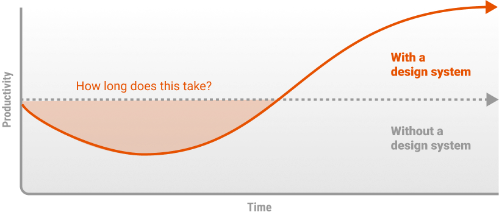
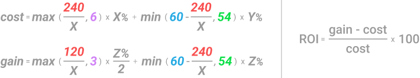
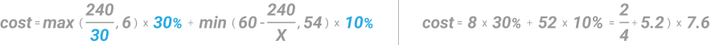
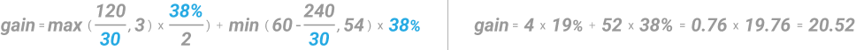
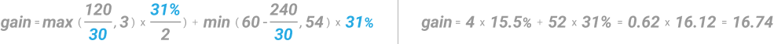

# Value Proposition

Investing in a design system can have a broad impact - on consistency, sentiment, accessibility, and even how much your team can ship. But the easiest ROI to align to business metrics is cost savings, most easily calculated based on efficiency. When implementing a design system, you will see a drop in productivity due to the necessary upfront investment. Still after a break-even point where the design system has grown enough to compensate for that, productivity gains are significant.

## Formula assumptions

A design system is ‘good’ for five years (=60 months). That is, we anticipate a major revamp every five years, e.g., due to a change in brand identity. This is where the `60` in the formula comes from.

If there were 200 designers and 200 developers who could all spend 20% of their time on a design system, things might move much faster than 12 months, and the `240` and `120` in the formula could be tweaked accordingly. We consider our assumption reasonable for an ‘average’ set-up with ~10 designers and ~30 developers (plus/minus).

A design system takes at least 6 months to set up. Anything less would be unrealistic in a real-world setting (due to coordination and alignment efforts), and we anticipated that no business would agree to invest more than 40% of designers’ or developers’ time in setting up a design system. That is why we have included the max and min functions in the formula, and that is where the `6` and `54` (60 months minus 6 months) come from.

We have 50% productivity gains. That is why we have `3` instead of `6` in the gain part of the formula. With these assumptions in place, we can now have a look at what the parameters X, Y, and Z mean.

**`X`** denotes the percentage of time invested in building the design system. If X=20, the formula gives us 240⁄20=12 months of ramp-up phase.

>[!Note]
>For **X<4.62**, the formula “breaks down” since the ramp-up phase would be ≥5 years.

**`Y`** denotes the percentage of time invested in ongoing maintenance after the ramp-up phase. In our specific case, we assumed 0.5X, but Y could be anything.

**`Z`** denotes the amount of time saved by using the design system in percent. This is equal to productivity or efficiency gains. Z denotes the amount of time saved by using the design system in percent. This is equal to productivity or efficiency gains.

**`X`** and **`Y`** are straightforward to specify you ‘just’ must agree on how much time you want to / can spend taking care of the design system. However, Z is a different story. Since it is the productivity gain yielded by the design system, it is impossible to know the parameter precisely beforehand. So, how can we estimate Z in a meaningful way?

This is a predictive judgment, so we followed the advice by  [Daniel Kahneman](https://en.wikipedia.org/wiki/Daniel_Kahneman). (2021) - considering the base rate of design system productivity gains by doing a literature review and averaging the numbers reported.

The existing studies about design system productivity gains:

- Reported 50%, 31%, and 34% better efficiency for design teams, which means an average of Z=38

	- [Klüver](https://www.youtube.com/watch?v=v8i1qeCv2IQ) (2019)
	- [Ray](https://uxdesign.cc/how-much-is-a-design-system-worth-d72e2ededf76) (2018)
	- [Slack](https://www.figma.com/blog/measuring-the-value-of-design-systems/) (2019)

- Reported 25%, 20%, and 47% better efficiency for development teams, which means an average of Z=31.

	- [Klüver](https://www.figma.com/blog/measuring-the-value-of-design-systems/) (2019)
	- [Loomer](https://www.projekt202.com/blog/2016/design-system) (2016)
	- [Sparkbox](https://sparkbox.com/foundry/design_system_roi_impact_of_design_systems_business_value_carbon_design_system) (n.d.).

We calculated ROI separately for design and development teams with the two different values for Z, and then aggregated it afterwards. In the next section, we will guide you through how exactly that works.

## Example case study

Fiserv has a team of 5 designers and a team of 10 developers who want to kick off building a design system together. They want to prove that the gains yielded by a design system in the mid- to long-term far exceed the necessary investment. Therefore, they grab the design system ROI formula and get going.

They estimate that everyone would be able to invest 30% (**`X=30`**) of their time during the ramp-up phase and afterwards 10% (**`Y=10`**) for maintenance. They moreover rely on the above base rates in the “Studies” section for productivity gains (**`Z=38`** for design, **`Z=31`** for development). They start with the ROI for the design team over the next five years.

### Design team

On the cost side, 30%-time investment means the ramp-up phase would be 240/30=8 months long. That is, 8*30%=2.4 months would be effectively spent on building the design system. Afterwards, 60-8=52 months remain for the 5-year period, and of those, 52*10%=5.2 months would be effectively spent on maintenance. Overall, there would be 7.6 months (out of five years) of work put into the design system.

On the gain side, a ramp-up phase of 8 months would mean four months of half the productivity gains. That is **`4*(38%/2) =0.76`** months. Afterwards, for the remaining 52 months (about 4 and a half years), we would see full productivity gains, i.e., **`52*38%=19.76`** months. Overall, the design system would therefore save the design team 20.52 months (about 1 year 8 and a half months) of needless work.

Together with the 7.6 months of work spent on building and maintaining the design system, this yields an ROI of **`(20.52-7.6)/7.6=170%`**. In other words, you get $2.70 back for every dollar invested in the design system.

If one designer costs $5,000 a month, that means the design system would cost Fiserv, 7.6*$5,000*5=$190,000 while it would save them **`20.52*$5,000*5=$513,000`** when looking at the design team alone.

### Development team

Doing the same thing for development is straightforward based on the above. Since the designers and developers at Fiserv agreed on everyone investing 30% for ramp-up and 10% for maintenance, the cost side stays the same. Like the designers, the developers will be busy with the design system for 7.6 months effectively over five years.
 
On the gain side, however, we must exchange the value for Z, from 38 to 31. Luckily, that is the only thing, and the rest remains as above.

So, in the case of development, we would invest 7.6 months and save 16.74 months of unnecessary work. This gives us an ROI of **`(16.74-7.6)/7.6=120%`**.

If one developer costs $6,000 a month, that means the design system would cost Fiserv **`7.6*$6,000*10=$456,000`** while it would save them a whooping **`16.74*$6,000*10=$1,004,400`** when looking at the development team alone.

## Estimated cost and gains

|                      | Cost             | Gain                                      | Return                                        |
| :------------------- | ----------------:| ----------------------------------------: | --------------------------------------------: |
| **Design Team**      | $190,000         | $513,000                                  | 170%                                          |
| **Development Team** | $456,000         | $1,004,400                                | 120%                                          |
|                      | **$642,000**  | **$1,517,400** (Net gains = $875,400)  | **135%** ($1,517,400 - $636,000)/$646,000) |

